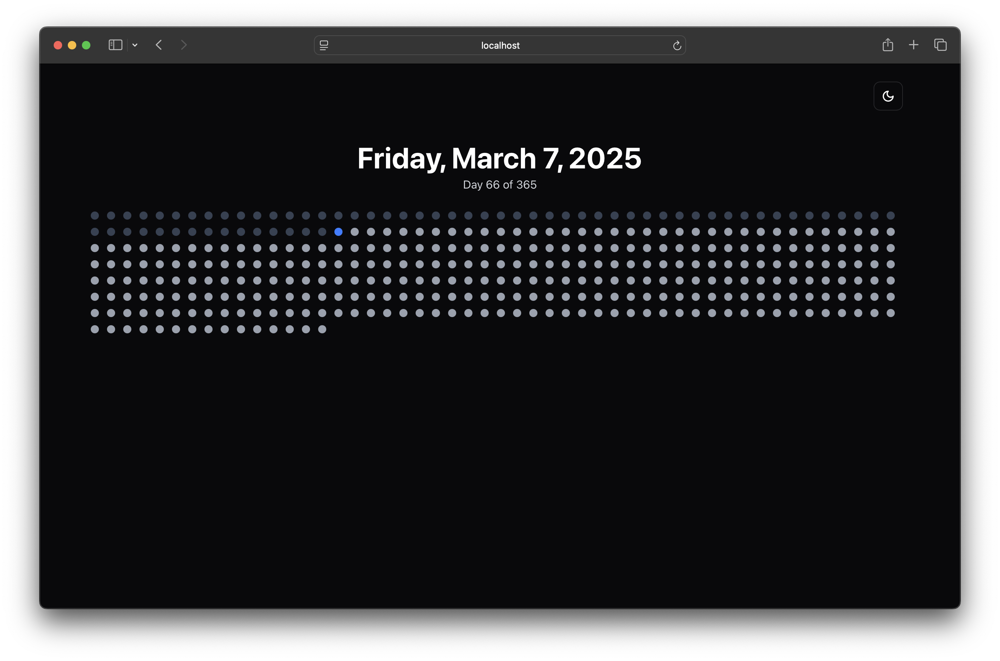

# Dotcal



**Dotcal** is a minimalistic dot calendar app that visually represents the entire year as a grid of dots. Each dot signifies a day, with the current day highlighted for easy reference. The interface is clean, intuitive, and designed for simplicity.

## Overview

Dotcal provides a unique way to view your year at a glance:

- **Year View Only:** See the complete year displayed as a grid of dots.
- **Current Day Highlight:** The present day is distinctly marked to show progress.
- **Tooltip Details:** Hover over any dot to see the corresponding date.
- **Interactive Modal:** Click on a dot to view additional details for that day.
- **Responsive Design:** Adapts smoothly to various screen sizes.

## Demo

Check out the live demo here: [https://dotcal.vercel.app](https://dotcal.vercel.app)

## Screenshots


## Installation

To run Dotcal locally, follow these steps:

1. **Clone the Repository:**

   ```bash
   git clone https://github.com/amrohan/dotcal.git
   cd dotcal
   ```

2. **Install Dependencies:**

   ```bash
   npm install
   ```

3. **Run the Development Server:**

   ```bash
   npm run dev
   ```

4. Open [http://localhost:3000](http://localhost:3000) in your browser to view Dotcal.

## Build

To build the project for production:

```bash
npm run build
```

Then start the production server with:

```bash
npm start
```

## Deployment

Dotcal can be easily deployed on platforms like Vercel or Cloudflare Pages. For instance, to deploy on Vercel:

1. Push your repository to GitHub.
2. Import your project into Vercel.
3. Follow the on-screen instructions to deploy your app.

## Technologies Used

- **Next.js**: The React framework powering the application.
- **Tailwind CSS**: For utility-first styling.
- **date-fns**: For date manipulation and formatting.
- **shadcn UI**: Provides modern, accessible UI components (such as Dialog and Tooltip).

## License

This project is licensed under the MIT License. See the [LICENSE](LICENSE) file for more details.

## Contributing

Contributions are welcome! Feel free to open an issue or submit a pull request for any improvements or bug fixes.

---

Happy scheduling with **Dotcal**!

```

Feel free to modify the URLs (cover image, demo, screenshot, repository) and any other details as needed for your project.
```
